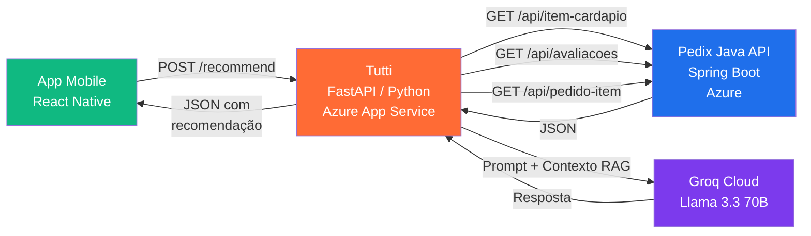

# 🍝 Tutti — Assistente de Recomendação do Pedix

> *"Tutti, o que vc me indica hoje?"*

**Tutti** é o assistente conversacional de recomendação de pratos do **Pedix**,
o sistema de comanda digital para restaurantes. Construído com **Python +
FastAPI**, **Llama 3.3 70B via Groq** e o padrão **RAG
(Retrieval-Augmented Generation)**, o Tutti consome o cardápio real, as
avaliações dos clientes e o histórico de pedidos para recomendar pratos
específicos em linguagem natural — direto no app mobile do Pedix.

---

## 👥 Grupo CodeGirls

| Nome | RM |
|---|---|
| Alane Rocha da Silva | RM561052 |
| Anna Beatriz de Araujo Bonfim | RM559561 |
| Maria Eduarda Araujo Penas | RM560944 |

**Curso:** Análise e Desenvolvimento de Sistemas — FIAP
**Disciplina:** Disruptive Architectures: IoT, IoB & Generative AI
**Sprint:** 4 (entrega final)
**Projeto:** Pedix — Comanda Digital Inteligente (Oracle Challenge)

---

## 🎯 O que o Tutti resolve

No fluxo tradicional, o cliente abre o cardápio digital e percorre dezenas
de itens sem nenhuma ajuda contextual. Isso gera indecisão, aumenta o
tempo de atendimento e o cliente acaba pedindo "o de sempre" — perdendo a
oportunidade de descobrir pratos novos e bem avaliados.

**O Tutti muda essa dinâmica.** O cliente digita o que quer em texto livre
("algo doce", "tenho pressa", "sou vegetariano") e o assistente responde
com uma recomendação personalizada e justificada, sempre referenciando o
nome exato e o preço do prato no cardápio real.

---

## 🏗️ Arquitetura



### Fluxo end-to-end

1. **App mobile** envia `POST /recommend` com a mensagem do cliente
2. **Tutti** consulta a Java API:
   - `/api/item-cardapio` → cardápio completo com descrições e categorias
   - `/api/avaliacoes` → notas e comentários dos clientes
   - `/api/pedido-item` → contagem de popularidade dos itens
3. Filtra itens `disponivel = true` e monta o **contexto RAG**
   (cardápio agrupado por categoria, avaliações médias, mais pedidos)
4. Envia o contexto + a mensagem do cliente para o **Groq (Llama 3.3 70B)**
5. Devolve a recomendação em JSON para o app

---

## 🤖 Por que LLM + RAG?

A decisão técnica detalhada está documentada no PDF da Sprint 3. Resumindo:

- **Modelo:** `llama-3.3-70b-versatile` (Meta Llama 3.3, 70B parâmetros, 128K context)
- **Provedor de inferência:** [Groq Cloud](https://groq.com) — gratuito e
  com latência muito baixa (LPU)
- **Padrão:** Retrieval-Augmented Generation (RAG) — o modelo **não tem
  conhecimento prévio** do restaurante; nós injetamos o contexto (cardápio,
  avaliações, popularidade) em cada requisição, garantindo que ele recomende
  apenas itens reais do cardápio atual

**Vantagens:**
- Não precisa retreinar nada quando o cardápio muda
- Funciona desde o primeiro dia, sem dataset proprietário
- Atualizações no cardápio refletem instantaneamente

---

## 🧰 Stack Tecnológica

| Camada | Tecnologia |
|---|---|
| Linguagem | Python 3.12 |
| Framework Web | FastAPI 0.115 |
| Servidor ASGI | Uvicorn |
| Cliente HTTP | httpx (async) |
| Configuração | Pydantic Settings + python-dotenv |
| Validação | Pydantic v2 |
| LLM SDK | Groq Python SDK |
| Modelo | Llama 3.3 70B Versatile (via Groq) |
| Deploy | Azure App Service (Linux, Python 3.12) |
| Mobile | React Native |

---

## 🚀 Rodando o Tutti localmente

### Pré-requisitos
- Python 3.12+
- Conta gratuita no [Groq Cloud](https://console.groq.com) para gerar uma API key

### 1. Clonar o repositório
```bash
git clone https://github.com/annabonfim/tutti-ai-pedix.git
cd tutti-ai-pedix
```

### 2. Criar ambiente virtual e instalar dependências
```bash
python3 -m venv .venv
source .venv/bin/activate          # macOS / Linux
# .venv\Scripts\activate           # Windows
pip install -r requirements.txt
```

### 3. Configurar variáveis de ambiente
```bash
cp .env.example .env
```

Edite o `.env`:
```env
GROQ_API_KEY=sua_chave_aqui
GROQ_MODEL=llama-3.3-70b-versatile
JAVA_API_BASE_URL=https://pedix-api-aab0evapangybdh7.eastus-01.azurewebsites.net
DOTNET_API_BASE_URL=http://localhost:5000
```

### 4. Rodar o servidor
```bash
python -m uvicorn app.main:app --reload
```

API em `http://127.0.0.1:8000`, Swagger em `http://127.0.0.1:8000/docs`.

---

## 📡 Endpoints

### `GET /`
Health check.

```json
{
  "status": "ok",
  "service": "Tutti — Pedix AI Recommendation Service",
  "version": "1.0.0"
}
```

### `POST /recommend`
Recebe a mensagem do cliente em linguagem natural e devolve uma
recomendação personalizada.

**Request:**
```json
{ "message": "Quero algo doce de sobremesa" }
```

**Response (200):**
```json
{
  "recommendation": "Eu recomendo o Sorvete por R$ 16.00, uma opção deliciosa e muito bem avaliada (5.0/5). Disponível em chocolate belga, baunilha de Madagascar, pistache, morango e limão siciliano — escolha perfeita para satisfazer seu desejo por algo doce!",
  "menu_size": 19,
  "ratings_considered": 5,
  "pedido_items_considered": 8
}
```

**Erros possíveis:**
- `502 Bad Gateway` — falha ao consultar a Java API
- `500 Internal Server Error` — falha na chamada ao Groq
- `422 Unprocessable Entity` — body inválido

---

## 📱 Integração com o App Mobile (React Native)

O app do Pedix consome o Tutti em produção via a URL pública do Azure.
Exemplo de chamada usando `fetch`:

```typescript
// src/services/tuttiService.ts
const TUTTI_BASE_URL =
  "https://tutti-ai-pedix.azurewebsites.net";  // URL do deploy

export async function pedirRecomendacao(mensagem: string) {
  const response = await fetch(`${TUTTI_BASE_URL}/recommend`, {
    method: "POST",
    headers: { "Content-Type": "application/json" },
    body: JSON.stringify({ message: mensagem }),
  });

  if (!response.ok) {
    throw new Error(`Tutti retornou ${response.status}`);
  }

  return response.json() as Promise<{
    recommendation: string;
    menu_size: number;
    ratings_considered: number;
    pedido_items_considered: number;
  }>;
}
```

Exemplo de uso na tela:

```typescript
// src/screens/TuttiScreen.tsx
import { useState } from "react";
import { View, Text, TextInput, Pressable, ActivityIndicator } from "react-native";
import { pedirRecomendacao } from "../services/tuttiService";

export function TuttiScreen() {
  const [mensagem, setMensagem] = useState("");
  const [resposta, setResposta] = useState<string | null>(null);
  const [carregando, setCarregando] = useState(false);

  async function handlePedir() {
    if (!mensagem.trim()) return;
    setCarregando(true);
    try {
      const { recommendation } = await pedirRecomendacao(mensagem);
      setResposta(recommendation);
    } catch (err) {
      setResposta("Ops, o Tutti não conseguiu responder agora.");
    } finally {
      setCarregando(false);
    }
  }

  return (
    <View>
      <Text>O que vc tá com vontade de comer hoje? 🍝</Text>
      <TextInput value={mensagem} onChangeText={setMensagem} />
      <Pressable onPress={handlePedir}>
        <Text>Pergunta pro Tutti</Text>
      </Pressable>
      {carregando && <ActivityIndicator />}
      {resposta && <Text>{resposta}</Text>}
    </View>
  );
}
```

---

## ☁️ Deploy no Azure

O Tutti roda no **Azure App Service** (Linux, Python 3.12), mesma cloud da
Java API — garantindo coerência da stack e latência mínima entre serviços.

Configuração do App Service:
- **Runtime stack:** Python 3.12
- **Startup command:** lido do `startup.txt` no repo
- **Application settings (env vars):**
  - `GROQ_API_KEY`
  - `GROQ_MODEL=llama-3.3-70b-versatile`
  - `JAVA_API_BASE_URL=https://pedix-api-aab0evapangybdh7.eastus-01.azurewebsites.net`

Deploy contínuo via GitHub: a cada push para `main`, o Azure rebuilda e
republica automaticamente.

---

## 📂 Estrutura do projeto

```
tutti-ai-pedix/
├── app/
│   ├── __init__.py
│   ├── main.py                  # Ponto de entrada FastAPI
│   ├── config.py                # Pydantic Settings
│   ├── routers/
│   │   ├── __init__.py
│   │   └── recommendations.py   # POST /recommend
│   └── services/
│       ├── __init__.py
│       ├── pedix_client.py      # Cliente HTTP para a Java API
│       └── groq_service.py      # Orquestração LLM + RAG
├── .env.example
├── .gitignore
├── requirements.txt
├── startup.txt                  # Comando de startup do Azure
└── README.md
```

---

## 🧪 Exemplos de uso

```bash
# Recomendação simples
curl -X POST "https://tutti-ai-pedix.azurewebsites.net/recommend" \
  -H "Content-Type: application/json" \
  -d '{"message": "Quero algo refrescante para beber"}'

# Com restrição alimentar
curl -X POST "https://tutti-ai-pedix.azurewebsites.net/recommend" \
  -H "Content-Type: application/json" \
  -d '{"message": "Sou vegetariano, o que voce sugere?"}'

# Pedindo pelo mais popular
curl -X POST "https://tutti-ai-pedix.azurewebsites.net/recommend" \
  -H "Content-Type: application/json" \
  -d '{"message": "Qual e o prato mais pedido?"}'
```

---

## ⚠️ Limitações Conhecidas

### Cold start do Azure App Service

A Java API e o Tutti estão hospedados no plano free do Azure, que coloca o
serviço em modo "sleep" após ~20 minutos de inatividade. A primeira chamada
após o sleep pode levar 20–30 segundos. Por isso, configuramos o timeout
do httpx em 60 segundos.

---

## 🐞 Bugs encontrados e corrigidos durante a Sprint 4

Durante a integração do Tutti com a Java API, identificamos um
`LazyInitializationException` do Hibernate no endpoint `/api/item-cardapio`
(relação com `CategoriaCardapio` carregada como `LAZY` sendo serializada
fora da sessão JPA). O bug foi reportado e corrigido em colaboração pelo
grupo (`fetch = FetchType.EAGER` no `@ManyToOne`), permitindo que o Tutti
acessasse o cardápio completo com descrições e categorias.

Esse processo demonstra a maturidade de engenharia esperada na entrega
final: identificar, reportar, resolver e documentar problemas reais de
integração entre serviços.

---

## 🔮 Próximos Passos

### Integração com a API .NET
A entidade `Pedido` está sendo migrada da API Java para a API .NET (junto
com `Atendimento`, `Mesa`, `Comanda`). Quando a migração concluir:

1. Adicionar `get_pedidos_from_dotnet()` em `pedix_client.py`
2. Substituir a fonte de popularidade do cardápio (hoje `/api/pedido-item`
   da Java) pelo endpoint equivalente da .NET
3. Adicionar autenticação JWT (a auth está sendo centralizada na .NET)

### Evoluções de produto
- **Personalização por cliente:** com JWT, considerar o histórico do
  cliente específico (não apenas o agregado do restaurante)
- **Múltiplas recomendações:** retornar 3 sugestões ranqueadas
- **Cache de cardápio:** TTL curto para reduzir latência
- **Observabilidade:** logs estruturados, métricas (OpenTelemetry)
- **Feedback do cliente:** botão "essa sugestão foi útil?" para fine-tunar
  o prompt ao longo do tempo

---

## 📈 Evolução Sprint 3 → Sprint 4

| Aspecto | Sprint 3 (Planejamento) | Sprint 4 (Implementação) |
|---|---|---|
| Entregável | Documentação + diagrama | Código funcional + demo |
| Identidade | "AI Recommendation Service" | **Tutti** (nome próprio) |
| Cardápio | Mock no diagrama | Integração real com Java API no Azure |
| Avaliações | Conceitual | `/api/avaliacoes` integrado |
| LLM | Llama 3.1 70B | Atualizado para Llama 3.3 70B (3.1 deprecado) |
| Endpoint | Especificado | `POST /recommend` rodando em produção |
| Mobile | Não escopado | Integração com o app React Native do Pedix |
| Deploy | Não escopado | Azure App Service |

---

## 📹 Vídeo Pitch

🎬 **Link do YouTube:** *(será preenchido após a gravação)*

---

## 📄 Documentação da Sprint 3

Para o contexto completo de planejamento (justificativa do modelo, escolha
do RAG, diagrama detalhado, fluxo end-to-end):
👉 [pedix-sprint3-iot](https://github.com/annabonfim/pedix-sprint3-iot)

---

## 📝 Licença

Projeto acadêmico desenvolvido para a FIAP no contexto do Oracle Challenge.
Uso restrito para fins educacionais.