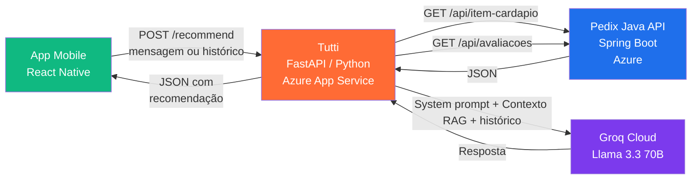

# 🍝 Tutti — Assistente de Recomendação do Pedix

> *"Tutti, o que vc me indica hoje?"*

**Tutti** é o assistente conversacional de recomendação de pratos do **Pedix**,
o sistema de comanda digital para restaurantes. Construído com **Python +
FastAPI**, **Llama 3.3 70B via Groq** e o padrão **RAG
(Retrieval-Augmented Generation)**, o Tutti consome o cardápio real e as
avaliações dos clientes para recomendar pratos específicos em linguagem
natural — direto no app mobile do Pedix.

---

## 👥 Grupo CodeGirls

| Nome | RM |
|---|---|
| Alane Rocha da Silva | RM561052 |
| Anna Beatriz de Araujo Bonfim | RM559561 |
| Maria Eduarda Araujo Penas | RM560944 |

**Curso:** Análise e Desenvolvimento de Sistemas — FIAP
**Disciplina:** Disruptive Architectures: IoT, IoB & Generative AI
**Sprint:** 4 (entrega final)
**Projeto:** Pedix — Comanda Digital Inteligente (Oracle Challenge)

---

## 🎯 Para o avaliador — testa em 3 curls (30s)

Sem precisar clonar nem rodar local. Bate direto no deploy do Azure:

```bash
# 1) Health check — confirma que o serviço tá no ar
curl https://tutti-ai-pedix.azurewebsites.net/

# 2) Recomendação simples — testa o RAG (cardápio + avaliações)
curl -X POST https://tutti-ai-pedix.azurewebsites.net/recommend \
  -H "Content-Type: application/json" \
  -d '{"message":"Quero algo doce de sobremesa"}'

# 3) ⭐ Segurança alimentar + sugestão de modificação (feature Sprint 4)
curl -X POST https://tutti-ai-pedix.azurewebsites.net/recommend \
  -H "Content-Type: application/json" \
  -d '{"message":"Sou vegetariano e intolerante a lactose, queria pedir a Pizza Margherita"}'
```

**Esperado no #3:** o Tutti reconhece a restrição, identifica que a
Margherita tem mussarela, e sugere **escrever "sem mussarela" nas
observações ao adicionar ao carrinho** (mostra que o LLM entende o
fluxo de UX do app). Cold start da Java API pode atrasar a 1ª chamada
em ~20s.

---

## 🎯 O que o Tutti resolve

No fluxo tradicional, o cliente abre o cardápio digital e percorre dezenas
de itens sem nenhuma ajuda contextual. Isso gera indecisão, aumenta o
tempo de atendimento e o cliente acaba pedindo "o de sempre" — perdendo a
oportunidade de descobrir pratos novos e bem avaliados.

**O Tutti muda essa dinâmica.** O cliente digita o que quer em texto livre
("algo doce", "tenho pressa", "sou vegetariano") e o assistente responde
com uma recomendação personalizada e justificada, sempre referenciando o
nome exato e o preço do prato no cardápio real.

---

## 🏗️ Arquitetura


```mermaid
flowchart LR
    A[App Mobile<br/>React Native] -->|POST /recommend<br/>mensagem ou histórico| B[Tutti<br/>FastAPI / Python<br/>Azure App Service]

    B -->|GET /api/item-cardapio| C[Pedix Java API<br/>Spring Boot<br/>Azure]
    B -->|GET /api/avaliacoes| C

    C -->|JSON| B

    B -->|System prompt + Contexto RAG + histórico| D[Groq Cloud<br/>Llama 3.3 70B]
    D -->|Resposta| B

    B -->|JSON com<br/>recomendação| A

    style A fill:#10B981,color:#fff
    style B fill:#FF6B35,color:#fff
    style C fill:#1F6FEB,color:#fff
    style D fill:#7C3AED,color:#fff
```

### Fluxo end-to-end

1. **App mobile** envia `POST /recommend` com a mensagem do cliente
   (ou o histórico completo da conversa pra chat multi-turn)
2. **Tutti** consulta a Java API:
   - `/api/item-cardapio` → cardápio completo com descrições e categorias
   - `/api/avaliacoes` → notas e comentários dos clientes
3. Filtra itens `disponivel = true` e monta o **contexto RAG**
   (cardápio agrupado por categoria + avaliações médias por item)
4. Envia o system prompt + contexto + histórico de conversa para o
   **Groq (Llama 3.3 70B)**
5. Devolve a recomendação em JSON para o app

---

## 🤖 Por que LLM + RAG?

A decisão técnica detalhada está documentada no PDF da Sprint 3. Resumindo:

- **Modelo:** `llama-3.3-70b-versatile` (Meta Llama 3.3, 70B parâmetros, 128K context)
- **Provedor de inferência:** [Groq Cloud](https://groq.com) — gratuito e
  com latência muito baixa (LPU)
- **Padrão:** Retrieval-Augmented Generation (RAG) — o modelo **não tem
  conhecimento prévio** do restaurante; nós injetamos o contexto (cardápio,
  avaliações, popularidade) em cada requisição, garantindo que ele recomende
  apenas itens reais do cardápio atual

**Vantagens:**
- Não precisa retreinar nada quando o cardápio muda
- Funciona desde o primeiro dia, sem dataset proprietário
- Atualizações no cardápio refletem instantaneamente

---

## 🔬 Como funciona por dentro

### O system prompt (engenharia de prompt deliberada)

Em vez de só "Você é um assistente útil", o Tutti tem um system prompt
estruturado em 4 blocos: **capacidades**, **limites**, **regras de
linguagem** e **regras de segurança alimentar**. Trecho real do código
([`groq_service.py`](app/services/groq_service.py)):

```text
SUAS CAPACIDADES:
- Recomendar pratos do cardápio com base em preferências, restrições e gostos
- Explicar ingredientes e características de cada prato
- Sugerir modificações que o cliente pode pedir via observações no carrinho

O QUE VOCÊ NÃO FAZ (importante):
- Você NÃO adiciona itens ao carrinho — o cliente faz isso pelo app
- Você NÃO faz pedidos ou envia comandas
- Você NÃO sabe a mesa, identidade do cliente ou histórico de pedidos
- Você NÃO promete entregar, cozinhar ou processar pagamento

REGRAS DE SEGURANÇA ALIMENTAR (CRÍTICAS):
5. Se o cliente mencionar RESTRIÇÃO (intolerância, alergia, vegetariano,
   vegano, sem glúten, sem lactose, etc.), você DEVE:
   a) Verificar cada ingrediente listado na descrição do prato.
   b) NUNCA recomendar item que viole a restrição, nem como "segunda opção"
      nem com qualificadores tipo "se possível, talvez, depende".
   c) Se um item está QUASE adequado, SUGIRA UMA MODIFICAÇÃO ESPECÍFICA E
      CONCRETA, indicando como pedir essa modificação no app.
```

Esse bloco resolve 3 problemas que a gente viu em iterações anteriores:

1. **LLM dizendo que ia fazer ação que não pode** ("já adicionei pra você")
2. **LLM recomendando item incompatível com qualificador fraco** ("se for
   adaptado pode servir") em vez de ser honesto
3. **Modificações vagas** ("pode pedir sem queijo") em vez de orientação
   clara ("escreve 'sem queijo' nas observações ao adicionar ao carrinho")

### O contexto RAG montado a cada requisição

A cada chamada, o `build_context()` consulta a Java API e monta um JSON
que vai como **segunda system message** pro Llama. Exemplo do que o
modelo recebe:

```text
CARDÁPIO COMPLETO (apenas itens disponíveis):

[BEBIDAS]
  - [1] Agua Mineral | R$ 5.50
      Ingredientes: Agua mineral sem gás, garrafa 500ml.
        Tags: vegano, sem gluten, sem lactose.
  - [27] Espresso Italiano | R$ 8.00
      Ingredientes: Café espresso curto italiano, blend arabica.

[PRATO]
  - [5] Pizza Margherita | R$ 35.00
      Ingredientes: Massa fina, molho de tomate San Marzano,
        mussarela de búfala, manjericão fresco, azeite extra virgem.
  - [12] Risotto ai Funghi | R$ 42.00
      Ingredientes: Arroz arbório, mix de cogumelos (porcini, shimeji,
        paris), parmesão Grana Padano, vinho branco.

[SOBREMESA]
  - [18] Tiramisu | R$ 18.00
      Ingredientes: Massa de biscoito champagne, café espresso, mascarpone,
        cacau em pó.

AVALIAÇÕES MÉDIAS:
- Tiramisu: 4.8/5 (3 avaliações)
- Pizza Margherita: 4.5/5 (2 avaliações)
```

Com esse contexto + a regra "verifique cada ingrediente listado", o LLM
consegue raciocinar: cliente quer sem lactose + Margherita → mussarela
está na descrição → propõe "sem mussarela" via observação.

**Importante:** o cardápio é re-carregado a **cada requisição**, então
qualquer mudança feita pelo gerente no app aparece instantaneamente —
zero cache, zero retreino.

---

## ✨ O que evoluiu na Sprint 4

A inteligência conversacional do Tutti recebeu três upgrades importantes:

### 💬 Chat multi-turn com histórico
O endpoint `/recommend` agora aceita o histórico inteiro da conversa
(até 20 mensagens). O cliente pode refinar pedidos em sequência
("e pra acompanhar?", "tem alguma opção mais leve?") sem precisar
repetir contexto. O modelo recebe todas as mensagens e mantém a
coerência da conversa.

### 🥦 Segurança alimentar real
O system prompt agora tem regras explícitas pra lidar com restrições:
- Verifica **cada ingrediente** listado na descrição do prato antes de recomendar
- Nunca sugere item que viole a restrição "como segunda opção" ou com qualificadores fracos
- Se nenhum item do cardápio atende, é honesto e orienta o cliente

### 🔧 Sugestão concreta de modificações
Quando um item está *quase* adequado pra restrição do cliente, o Tutti
sugere a modificação específica + **como pedir via observação do pedido
no app**. Exemplo real:

> "A Pizza Margherita (R$ 35,00) pode ser feita sem mussarela — é só
> escrever 'sem mussarela' nas observações ao adicionar ao carrinho."

Essa orientação só faz sentido porque o backend agora persiste o campo
`observacao` no pedido (Sprint 4 add no `pedix-dotnet-api`), e a
mensagem chega ao garçom.

### 🚫 Honestidade sobre limites
O prompt deixa claro o que o Tutti **NÃO** faz: não adiciona ao
carrinho, não envia pedido, não conhece a mesa/cliente. Evita
alucinações tipo "já adicionei pra você" que aconteciam no início.

---

## 🧠 Decisões de design & trade-offs

Decisões técnicas importantes que tomamos, com o "porquê" e o que abrimos
mão. Estilo [ADR](https://adr.github.io) resumido.

### Por que **Groq** (não OpenAI/Anthropic)?

| Critério | Groq Llama 3.3 70B | OpenAI GPT-4o | Anthropic Claude 3.5 |
|---|---|---|---|
| Custo na demo | **Grátis** (free tier) | ~$0.005/req | ~$0.003/req |
| Latência | **~400ms** (LPU) | 1-3s | 1-3s |
| Quality pra PT-BR | Muito boa | Excelente | Excelente |
| Cadastro | E-mail só | Cartão | Cartão |

**Trade-off:** GPT-4o e Claude provavelmente dariam respostas marginalmente
melhores em ambiguidade complexa. Pra projeto acadêmico com 3 categorias
de comida italiana e ~20 itens, a margem não compensa o custo + atrito
de cadastro do avaliador.

### Por que **Llama 3.3 70B Versatile** (não 3.1, não menor, não maior)?

- **3.1 70B** estava no Sprint 3 → foi **deprecado pela Groq** durante
  a Sprint 4 (a gente recebeu erro na API e atualizou)
- **8B** (modelo menor): testado em dev — alucina nomes de pratos
  ("recomendo o Spaghetti Bolognese de Frutos do Mar") e ignora regras
  complexas do system prompt
- **405B** (modelo maior): overkill pro caso — latência 2-3x maior,
  mesma qualidade percebida pra este domínio

### Por que **RAG** (não fine-tuning)?

| Aspecto | RAG (escolhido) | Fine-tuning |
|---|---|---|
| Atualização do cardápio | **Instantânea** (próxima request) | Re-treinar e re-deployar |
| Custo de setup | Zero | $$$ + dataset rotulado |
| Conhecimento do restaurante | Sempre consistente com DB | Pode driftar |
| Personalização por restaurante | Trivial (muda só o contexto) | 1 modelo por restaurante |

**Trade-off:** RAG manda ~1500 tokens de cardápio em cada request, gastando
context window. Fine-tuning seria 0 tokens, mas exigiria dataset e
re-treino toda vez que o cardápio mudasse — inviável pra restaurante real.

### Por que **chat multi-turn** em vez de single-shot only?

Adicionado na Sprint 4 (`f175cac`). Cliente real refina pedidos em
sequência ("e pra acompanhar?", "tem algo mais leve?"). Single-shot
forçaria o cliente a repetir contexto a cada mensagem.

**Trade-off:** payload maior (até 20 mensagens) e mais tokens consumidos.
Limitamos em **20 mensagens** no `RecommendRequest` pra evitar abuso e
custo descontrolado em produção.

### Por que **remover `/api/pedido-item`** do RAG (Sprint 4)?

Originalmente o Tutti usava esse endpoint pra "popularidade" (quantas
vezes cada item foi pedido). Quando a Java API ligou auth nesse endpoint,
o Tutti — serviço-pra-serviço sem JWT — começou a tomar 401.

**Opções consideradas:**
1. Implementar auth no Tutti (gerar JWT de service account) → complexidade desnecessária
2. Pedir pra Alane abrir o endpoint pra `permitAll` → vazaria info de pedidos
3. **Aceitar que avaliações cobrem o sinal de popularidade indiretamente** → escolhido

Pratos populares tendem a acumular avaliações, então o LLM ainda
consegue identificar "o que dá certo" via `AVALIAÇÕES MÉDIAS` no contexto.

### Por que **temperature=0.5** e **max_tokens=300**?

- **temperature=0.5**: balanço entre determinismo (alta = inconsistente)
  e variação (zero = robótico, sempre mesma resposta). 0.5 dá respostas
  diferentes em chamadas repetidas mas coerentes.
- **max_tokens=300**: respostas devem ser curtas (3 frases conforme regra
  do prompt). 300 cobre com folga e impede o modelo de "discursar" se
  ignorar a restrição.

---

## 🧰 Stack Tecnológica

| Camada | Tecnologia |
|---|---|
| Linguagem | Python 3.12 |
| Framework Web | FastAPI 0.115 |
| Servidor ASGI | Uvicorn |
| Cliente HTTP | httpx (async) |
| Configuração | Pydantic Settings + python-dotenv |
| Validação | Pydantic v2 |
| LLM SDK | Groq Python SDK |
| Modelo | Llama 3.3 70B Versatile (via Groq) |
| Deploy | Azure App Service (Linux, Python 3.12) |
| Mobile | React Native |

---

## 🚀 Rodando o Tutti localmente

### Pré-requisitos

| Ferramenta | Versão | Como instalar |
|---|---|---|
| **Python** | 3.12+ | macOS: `brew install python@3.12` · Linux: `apt install python3.12 python3.12-venv` · Windows: [python.org](https://www.python.org/downloads/) |
| **Git** | qualquer recente | `git --version` pra confirmar |
| **Conta Groq Cloud** | grátis | https://console.groq.com (free tier cobre o uso da demo com folga) |

Não precisa subir nenhum backend local — o `.env.example` já aponta a
URL pública da Java API no Azure. Se a Java estiver no cold start
demora ~20s na primeira chamada do Tutti.

### 1. Clonar o repositório

```bash
git clone https://github.com/annabonfim/tutti-ai-pedix.git
cd tutti-ai-pedix
```

### 2. Criar ambiente virtual e instalar dependências

```bash
# Cria a venv (única vez)
python3.12 -m venv .venv

# Ativa a venv (toda nova sessão de terminal)
source .venv/bin/activate          # macOS / Linux
# .venv\Scripts\activate           # Windows (PowerShell)

# Instala as dependências dentro da venv
pip install -r requirements.txt
```

> Confirma que tá usando a venv certa: `which python` deve apontar pra
> `.venv/bin/python` dentro do projeto.

### 3. Gerar a API Key do Groq

1. Cria conta grátis em **https://console.groq.com**
2. Vai em **API Keys** (menu lateral) → **Create API Key**
3. Dá um nome (ex: `pedix-local`) → copia a chave (`gsk_...`) — ela aparece UMA vez só, não esquece de salvar
4. Free tier permite milhares de requisições/dia — suficiente pra demo e dev

### 4. Configurar variáveis de ambiente

```bash
cp .env.example .env
```

Abre o `.env` e cola a chave que você gerou:

```env
GROQ_API_KEY=gsk_SUA_CHAVE_AQUI
GROQ_MODEL=llama-3.3-70b-versatile
JAVA_API_BASE_URL=https://pedix-api-aab0evapangybdh7.eastus-01.azurewebsites.net
```

⚠️ Nunca commitar o `.env` (já tá no `.gitignore`).

### 5. Rodar o servidor

```bash
python -m uvicorn app.main:app --reload
```

- API em **http://127.0.0.1:8000**
- Swagger UI interativo em **http://127.0.0.1:8000/docs**
- `--reload` faz hot-reload toda vez que você salva um arquivo `.py`

### 6. Smoke test (confirma que tá tudo rodando)

Em outro terminal, rodando 3 chamadas:

```bash
# Health check
curl http://127.0.0.1:8000/
# Esperado: {"status":"ok","service":"Tutti — ...","version":"1.0.0"}

# Recomendação single-shot
curl -X POST http://127.0.0.1:8000/recommend \
  -H "Content-Type: application/json" \
  -d '{"message":"Quero algo doce de sobremesa"}'

# Chat multi-turn
curl -X POST http://127.0.0.1:8000/recommend \
  -H "Content-Type: application/json" \
  -d '{
    "messages": [
      {"role":"user","content":"Sou vegetariano, o que sugere?"},
      {"role":"assistant","content":"Recomendo a Pizza Margherita (R$ 35,00)."},
      {"role":"user","content":"E de sobremesa?"}
    ]
  }'
```

Se as 3 retornarem 200, tá tudo funcionando. Erros comuns:
- `401 Invalid API Key` → confere se colou a chave certa no `.env`
- `502 Bad Gateway` → Java API tá em cold start. Aguarda 30s e tenta de novo.
- `ConnectionError` → confere se a venv tá ativa e o uvicorn tá rodando.

---

## 📡 Endpoints

### `GET /`
Health check.

```json
{
  "status": "ok",
  "service": "Tutti — Pedix AI Recommendation Service",
  "version": "1.0.0"
}
```

### `POST /recommend`
Recebe a mensagem do cliente (ou o histórico completo da conversa) em
linguagem natural e devolve uma recomendação personalizada.

Aceita **dois formatos** de body (mutuamente exclusivos):

**Formato 1 — single-shot (legacy)**
```json
{ "message": "Quero algo doce de sobremesa" }
```

**Formato 2 — chat multi-turn** (recomendado pro fluxo real do app):
```json
{
  "messages": [
    { "role": "user", "content": "Sou vegetariano, o que sugere?" },
    { "role": "assistant", "content": "Recomendo a Pizza Margherita (R$ 35,00)." },
    { "role": "user", "content": "E pra acompanhar?" }
  ]
}
```

- Até **20 mensagens** no histórico (proteção contra abuso/tokens)
- A última mensagem deve ter `role: "user"` (é a pergunta atual)
- Enviar `message` e `messages` juntos retorna 422

**Response (200):**
```json
{
  "recommendation": "Recomendo o Sorvete (R$ 16,00) — está com 5.0/5 em avaliações. Disponível em chocolate belga, baunilha, pistache, morango e limão siciliano. É só adicionar ao carrinho quando quiser!",
  "menu_size": 19,
  "ratings_considered": 5
}
```

**Erros possíveis:**
- `502 Bad Gateway` — falha ao consultar a Java API
- `500 Internal Server Error` — falha na chamada ao Groq
- `422 Unprocessable Entity` — body inválido (envio dos dois formatos, vazio, ou última msg não é do user)

---

## 📱 Integração com o App Mobile (React Native)

O app do Pedix consome o Tutti em produção via a URL pública do Azure.
Exemplo de chamada usando `fetch`:

```typescript
// src/services/tuttiService.ts
const TUTTI_BASE_URL =
  "https://tutti-ai-pedix.azurewebsites.net";  // URL do deploy

export async function pedirRecomendacao(mensagem: string) {
  const response = await fetch(`${TUTTI_BASE_URL}/recommend`, {
    method: "POST",
    headers: { "Content-Type": "application/json" },
    body: JSON.stringify({ message: mensagem }),
  });

  if (!response.ok) {
    throw new Error(`Tutti retornou ${response.status}`);
  }

  return response.json() as Promise<{
    recommendation: string;
    menu_size: number;
    ratings_considered: number;
    pedido_items_considered: number;
  }>;
}
```

Exemplo de uso na tela:

```typescript
// src/screens/TuttiScreen.tsx
import { useState } from "react";
import { View, Text, TextInput, Pressable, ActivityIndicator } from "react-native";
import { pedirRecomendacao } from "../services/tuttiService";

export function TuttiScreen() {
  const [mensagem, setMensagem] = useState("");
  const [resposta, setResposta] = useState<string | null>(null);
  const [carregando, setCarregando] = useState(false);

  async function handlePedir() {
    if (!mensagem.trim()) return;
    setCarregando(true);
    try {
      const { recommendation } = await pedirRecomendacao(mensagem);
      setResposta(recommendation);
    } catch (err) {
      setResposta("Ops, o Tutti não conseguiu responder agora.");
    } finally {
      setCarregando(false);
    }
  }

  return (
    <View>
      <Text>O que vc tá com vontade de comer hoje? 🍝</Text>
      <TextInput value={mensagem} onChangeText={setMensagem} />
      <Pressable onPress={handlePedir}>
        <Text>Pergunta pro Tutti</Text>
      </Pressable>
      {carregando && <ActivityIndicator />}
      {resposta && <Text>{resposta}</Text>}
    </View>
  );
}
```

---

## ☁️ Deploy no Azure

O Tutti roda no **Azure App Service** (Linux, Python 3.12), mesma cloud da
Java API — garantindo coerência da stack e latência mínima entre serviços.

Configuração do App Service:
- **Runtime stack:** Python 3.12
- **Startup command:** lido do `startup.txt` no repo
- **Application settings (env vars):**
  - `GROQ_API_KEY`
  - `GROQ_MODEL=llama-3.3-70b-versatile`
  - `JAVA_API_BASE_URL=https://pedix-api-aab0evapangybdh7.eastus-01.azurewebsites.net`

Deploy contínuo via GitHub: a cada push para `main`, o Azure rebuilda e
republica automaticamente.

---

## 📂 Estrutura do projeto

```
tutti-ai-pedix/
├── app/
│   ├── __init__.py
│   ├── main.py                  # Ponto de entrada FastAPI
│   ├── config.py                # Pydantic Settings
│   ├── routers/
│   │   ├── __init__.py
│   │   └── recommendations.py   # POST /recommend
│   └── services/
│       ├── __init__.py
│       ├── pedix_client.py      # Cliente HTTP para a Java API
│       └── groq_service.py      # Orquestração LLM + RAG
├── .env.example
├── .gitignore
├── requirements.txt
├── startup.txt                  # Comando de startup do Azure
└── README.md
```

---

## 🧪 Exemplos de uso

```bash
# Recomendação simples
curl -X POST "https://tutti-ai-pedix.azurewebsites.net/recommend" \
  -H "Content-Type: application/json" \
  -d '{"message": "Quero algo refrescante para beber"}'

# Com restrição alimentar
curl -X POST "https://tutti-ai-pedix.azurewebsites.net/recommend" \
  -H "Content-Type: application/json" \
  -d '{"message": "Sou vegetariano, o que voce sugere?"}'

# Pedindo pelo mais popular
curl -X POST "https://tutti-ai-pedix.azurewebsites.net/recommend" \
  -H "Content-Type: application/json" \
  -d '{"message": "Qual e o prato mais pedido?"}'
```

---

## ⚠️ Limitações Conhecidas

### Cold start do Azure App Service

A Java API e o Tutti estão hospedados no plano free do Azure, que coloca o
serviço em modo "sleep" após ~20 minutos de inatividade. A primeira chamada
após o sleep pode levar 20–30 segundos. Por isso, configuramos o timeout
do httpx em 60 segundos.

---

## 🐞 Bugs e ajustes durante a Sprint 4

**1. `LazyInitializationException` no `/api/item-cardapio`**
Hibernate carregava `CategoriaCardapio` como `LAZY` e serializava fora da
sessão JPA — Tutti não conseguia ler categoria/descrição. Reportado no
grupo, corrigido na Java API com `fetch = FetchType.EAGER` no `@ManyToOne`.

**2. `/api/pedido-item` removido da fonte de dados do Tutti**
Originalmente o Tutti consumia esse endpoint pra inferir popularidade
(quantas vezes cada item foi pedido). Quando a Java API ligou auth nos
endpoints de write, o `pedido-item` passou a exigir JWT e o Tutti — que
é um serviço-pra-serviço sem credencial — parou de conseguir ler. Como
"popularidade" não era core do produto, removemos do RAG (commit
`e3bbf16`). Hoje o Tutti usa só **cardápio + avaliações** como contexto,
e o sinal de "popularidade" vem implicitamente via nota das avaliações.

**3. Renomeação para "Tutti" como identidade**
Sprint 3 chamava "AI Recommendation Service" no código e nos logs. Sprint 4
formalizou o nome **Tutti** em todos os pontos (system prompt, README,
mensagens de erro, branding no app mobile).

---

## 🔮 Próximos Passos

### Evoluções de produto
- **Personalização por cliente:** com a auth JWT já no app, considerar
  o histórico do cliente específico (não apenas o agregado do
  restaurante) — exigiria expor um endpoint autenticado na .NET
- **Múltiplas recomendações:** retornar 3 sugestões ranqueadas
- **Cache de cardápio:** TTL curto pra reduzir latência (cardápio muda
  pouco, ~1x/semana)
- **Observabilidade:** logs estruturados, métricas (OpenTelemetry) —
  o Tutti hoje só tem print do traceback em caso de erro
- **Feedback do cliente:** botão "essa sugestão foi útil?" pra ajustar
  o prompt ao longo do tempo
- **Streaming SSE:** entregar a resposta token-a-token (Groq suporta)
  pra UX mais responsiva no chat do app

---

## 📈 Evolução Sprint 3 → Sprint 4

| Aspecto | Sprint 3 (Planejamento) | Sprint 4 (Implementação) |
|---|---|---|
| Entregável | Documentação + diagrama | Código funcional + demo no app |
| Identidade | "AI Recommendation Service" | **Tutti** (nome próprio + branding) |
| Cardápio | Mock no diagrama | Integração real com Java API no Azure |
| Avaliações | Conceitual | `/api/avaliacoes` integrado e considerado no RAG |
| LLM | Llama 3.1 70B | Atualizado pra Llama 3.3 70B (3.1 deprecado) |
| Endpoint | Especificado | `POST /recommend` em produção no Azure |
| Modo de uso | Single-shot | **Chat multi-turn** com histórico de até 20 mensagens |
| Inteligência | "Recomenda pratos" | **Regras de segurança alimentar** + **sugestão concreta de modificações** via observação no pedido |
| Mobile | Não escopado | Chat flutuante integrado em todas as telas do cliente + notificação proativa |
| Deploy | Não escopado | Azure App Service com CI/CD via GitHub |

---

## 📹 Vídeo Pitch

🎬 **Link do YouTube:** https://youtu.be/0DtW9oS6_VM

---

## 🔗 Projetos relacionados

| Projeto | Repositório | Deploy / APK |
|---|---|---|
| 📱 **App mobile** (React Native) que consome o Tutti | [annabonfim/pedix-app](https://github.com/annabonfim/pedix-app) | [APK no EAS Build](https://expo.dev/accounts/annabonfim/projects/pedix/builds/2e97249e-240e-41b2-8663-688ca7a8d01c) + Firebase App Distribution (convite ao professor) |
| ☕ **API Java** (Spring Boot) — cardápio, avaliações | [alanerochaa/pedix-api](https://github.com/alanerochaa/pedix-api) | https://pedix-api-aab0evapangybdh7.eastus-01.azurewebsites.net |
| 🔷 **API .NET** (ASP.NET Core) — auth, pedidos, pagamentos | [annabonfim/pedix-dotnet-api](https://github.com/annabonfim/pedix-dotnet-api) | https://pedix-dotnet-api-anna.azurewebsites.net |

---

## 📄 Documentação da Sprint 3

Para o contexto completo de planejamento (justificativa do modelo, escolha
do RAG, diagrama detalhado, fluxo end-to-end):
👉 [pedix-sprint3-iot](https://github.com/annabonfim/pedix-sprint3-iot)

---

## 📝 Licença

Projeto acadêmico desenvolvido para a FIAP no contexto do Oracle Challenge.
Uso restrito para fins educacionais.
